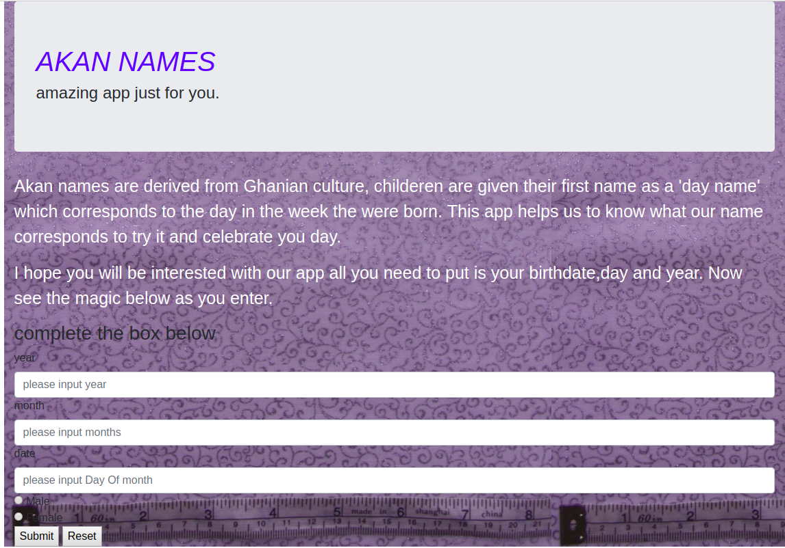

# AKAN NAMES

##AUTHOR

Feisal Ahmed

## DESCRIPTION

- This is a web app that enables a user to enter their date of birth and it calculates their Akan name according to the day of the week they were born.

## DEPLOY

This project is deployed in GitHub. You can find the live link at: https://feisalahmed.github.io/Akan-Names/

##TECHNOLOGY USED

- HTML
- CSS
- JAVASCRIPT

##PROJECT SETUP

- To access the website online, you only need a modern browser and visit the website [here](https://feisalahmed.github.io/Akan-Names/)
- To use the website offline, just clone it and move to the root folder and open ```index.html```
- To clone the app for use offline, in the terminal, type the following:
```bash
git clone https://github.com/FeisalAhmed/Akan-Names.git
```

## CONTACT DETAIL

For any comments and queries, don't hesitate to contact me on: feizulf@gmail

## BDD



- A user visits the site and enters valid date of birth
- If a user enters incorrect information, they're given an alert informing them of what should be done
- When a user enters correct information, they're given an alert showing them their Akan name

## LICENSE

The MIT License (MIT)

**Copyright (c) 2019 Feisal Ahmed**

Permission is hereby granted, free of charge, to any person obtaining a copy of this software and associated documentation files (the "Software"), to deal in the Software without restriction, including without limitation the rights to use, copy, modify, merge, publish, distribute, sublicense, and/or sell copies of the Software, and to permit persons to whom the Software is furnished to do so, subject to the following conditions:

The above copyright notice and this permission notice shall be included in all copies or substantial portions of the Software.

THE SOFTWARE IS PROVIDED "AS IS", WITHOUT WARRANTY OF ANY KIND, EXPRESS OR IMPLIED, INCLUDING BUT NOT LIMITED TO THE WARRANTIES OF MERCHANTABILITY, FITNESS FOR A PARTICULAR PURPOSE AND NONINFRINGEMENT. IN NO EVENT SHALL THE AUTHORS OR COPYRIGHT HOLDERS BE LIABLE FOR ANY CLAIM, DAMAGES OR OTHER LIABILITY, WHETHER IN AN ACTION OF CONTRACT, TORT OR OTHERWISE, ARISING FROM, OUT OF OR IN CONNECTION WITH THE SOFTWARE OR THE USE OR OTHER DEALINGS IN THE SOFTWARE.